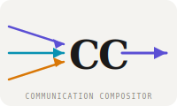

# Communication Compositor (CC)

> Compose personalised communications from reusable content blocks — drag, tick, order, build.



*Conceived and built by Richard Sargeant with Claude (Anthropic) as design partner and co-builder, April 2026.*

---

## What is it?

Communication Compositor is a React UI for assembling personalised letters and emails from a library of reusable content blocks stored in Microsoft OneNote.

Instead of writing each communication from scratch, you maintain a block store — paragraphs about health, work, travel, family or whatever you need — and compose each letter by selecting and ordering the relevant blocks. The compositor builds a properly formatted Word document via the Microsoft Graph API.

**Origin:** The use case is personal circular letters where some blocks suit some recipients but not others. Rather than editing a master letter each time, you compose from blocks, tick what's relevant, drag to order, and build.

---

## Features

- 📦 **Block library** — content fetched from OneNote via Microsoft Graph API
- 🗂️ **Grouped sections** — blocks organised by section, collapsible
- ↕️ **Drag & reorder** — drag section headers or individual blocks; ↑↓ arrows as fallback
- ✅ **Tick to include/exclude** — all blocks ticked by default; recipient rules auto-untick
- 👤 **Recipient selector** — omission rules per recipient; multiple emails with primary selector
- ↩ **Undo/Redo** — granular undo stack (Ctrl+Z / Ctrl+Y), covers every action including ticks
- 🔨 **BUILD** — confirm overlay showing final ordered list before building
- ✕ **CANCEL** — guards against accidental quit with unsaved changes
- ⚙️ **Settings** — light/dark mode, recipient management, OneNote notebook selector (coming)
- 🌞 **Light mode default** — clean, document-friendly

---

## Quick Start

```bash
npm install
npm run dev
```

Runs with **mock data** by default — no Microsoft 365 account needed to explore the UI.

To wire live OneNote data, see [docs/graph-api-setup.md](docs/graph-api-setup.md) (coming) and [ROADMAP.md](ROADMAP.md).

---

## Architecture

```
OneNote Block Store
  └── Notebook: "CC Blocks"
        ├── Section: Blocks - Author - Category
        │     ├── Page: Block name (draggable card)
        │     └── ...
        └── ...

Compositor UI  (React, this repo)
  └── Fetches sections + pages via Graph API
  └── User reorders + ticks
  └── BUILD → Word XML pipeline → SharePoint
```

### Prompt syntax (planned)

```
Build a communication in Word for [recipient]
using blocks from [section], [section] and [section]-[section] and [section]*
```

- Fuzzy section name matching with confirmation before fetch
- Range support: `A to B` resolved against notebook section order  
- Wildcard support: `Richard*` matches all `Blocks - Richard - *` sections
- Lazy-load snippets if >20 pages

---

## Word Document Pipeline

BUILD produces a `.docx` via direct XML manipulation — see [docs/word-xml-pipeline.md](docs/word-xml-pipeline.md).

---

## Contributing

See [CONTRIBUTING.md](CONTRIBUTING.md). All welcome.

## Licence

MIT — see [LICENSE](LICENSE)
